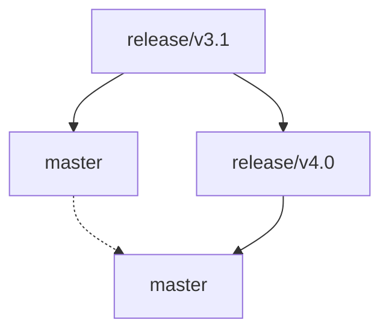

Branching and Releasing
=======================

`master` is the primary development branch in `mobilecoin.git`.

Changes are created via PRs, reviewed, and squash-merged into `master`.

Sometimes long running feature branches are created. These are, still, eventually
squash merged into `master`.

Release branches
----------------

Major releases are created by creating a release branch e.g. `release/v4.0` off
of master.

Minor releases are created by creating a release branch e.g. `release/v4.1` off of
the predecessor `release/v4.0`.

Release candidates are tagged on release branches.

Propagating changes
-------------------

Changes which are made in release branches are propagated forward to master,
by *merging* the release branch into master.

* The release branch is not deleted after this merge.
* This is a normal git merge and not a squash merge or a rebase merge.
  The purpose of this is to avoid git conflicts.

Merging means that git will look at the state of the release branch, check if
any commits on it have not already been merged into master, and if not, attempt
to apply those diffs onto master (using 3-way merge conflict resolution).

After a commit from release branch has been merged this way, it will never be
considered by a future merge and can never create a conflict in a future merge.
(This is a major difference with squash merging and rebase merging. This is very
important when merging long-lived branches and not small PRs.)

This leads to a diagram like the following:

When to merge the release branch
--------------------------------

It is always desirable for the release branch to merge "cleanly" to master.
This ensures that all bug fixes (and changelog updates) in the release branch
were incorporated into master, and there can be no confusion about what fixes
made it back.

It is acceptable to merge the release branch to master at any of the following times:

* After making a change in the release branch
* On a periodic basis
* After finishing the release

Currently, we want this merge to happen via a PR and go through (usually perfunctory)
review. Reviewers should check that this is not a squash merge or a rebase merge.

Right now we think it's desirable that whenever the release branch moves forwards,
a PR could be opened automatically that proposes merges the release branch to master,
exposing any git conflicts, which can then be reviewed and resolved.

Making changes
--------------

Developers make changes using PRs the same way as always, and are free to
squash-merge their development PRs as they historically have. (It doesn't much
matter for this workflow whether or not developer PRs are squash merges.)

When a developer wants to make a change, they should ask themselves, should this
go in the latest release branch, or in master?

* Changes which go to the release branch will eventually be merged forwards to
  master. No cherry-picking will be necessary. This is usually the right thing
  for a bug fix.
* Changes which should NOT go into the release branch should just go to master.

This decision tree covers the majority of changes, and does not involve any
cherry-picking.

Sometimes, a developer will make a PR to master, but then later realize it
should have gone to the release branch.

* At this point, you have to cherry-pick the change back to the release branch.
* You can cherry-pick your commit(s) from master.
* You should expect a git conflict to occur when release is merged into master
  after this. This is because a cherry-picked commit has a different hash from
  the original commit, and git does not consider them "the same" when merging,
  they are instead very similar commits touching the same code.
* You will have to resolve this conflict, which usually won't be too hard.
* To avoid this situation, make sure you consider whether a change should go
  to master or the release branch. If in doubt, ask in the channel.

Multiple concurrent releases
----------------------------

It's not very easy for mobilecoin to accommodate multiple concurrent releases.
This is because there's only one alphanet, only one testnet, and only one mainnet.
So the release process can't easily happen for two different releases in parallel,
and historically we've never had to attempt that. (It's also very labor intensive
to sign an enclave.)

Should it become necessary to support multiple concurrent releases,
the workflow extends naturally:

* Changes target the *earliest* release branch where they are relevant
* *Earlier* release branches merge forward into the newer release branches
* The newest release branch merges into master.

Note that git merge handles well the semantics when a diamond pattern is created.
Suppose the following merges occur:

Even though a commit in `release/v3.1` may follow two paths into master branch,
it does not conflict with itself under a `git merge`. (This is another reason
why a normal git merge should always be preferred when merging two long-lived branches.)

Comparisons
-----------

Historically, `mobilecoin.git` did not use merging at all when handling release branches.

* We branch for release e.g. `release/v2.0` of off master.
* Developers (usually) make bug fix commits in release branch, or,
  cherry-pick them back to release branch.
* We tag release candidates and releases on release branch.
* If a point release is needed off of a major release, then we branch e.g.
  `release/v2.1` off of `release/v2.0` and make more commits.
* After the release is done, the release branch is abandoned and nothing more is done with it.

In this model:

* Release branches are never merged anywhere
* Any changes that need to be in master and release (which is most changes)
  get cherry-picked.

This is an example of what this looks like:

The main drawbacks of this are:

* Changes are being cherry-picked in two directions, which can be confusing and
  can lead to additional git conflicts.
* Changes are sometimes cherry-picked from release to master in reverse order
  to how they occurred on release. This can create confusion and additional git conflicts.
* Sometimes changes in release are forgotten about and never cherry-picked to master.
  This leads to regressions in the next release. Because we never merge the release
  branch back to master, and all the cherry-picks have different hashes from their
  originals, it's very hard to ever be sure that we got all the changes.

This merge-based proposal hopes to rectify these issues.
