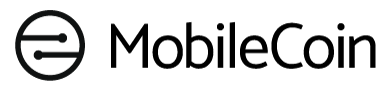

### Testing your first payment

* Please see [*TESTNET.md*](./TESTNET.md) for instructions on participating in the TestNet!

### Sending your first payment

* Please see [*MAINNET.md*](./MAINNET.md) for instructions on using MobileCoin!
* You must read and accept the [Terms of Use for MobileCoins and MobileCoin Wallets](./TERMS-OF-USE.md) to use MobileCoin Software.

### Note to Developers

* MobileCoin is a prototype. Expect substantial changes before the release.
* Please see [*CONTRIBUTING.md*](./CONTRIBUTING.md) for notes on contributing bug reports and code.

# MobileCoin
MobileCoin is a privacy-preserving payments network designed for use on mobile devices.

# Table of Contents
- [License](#license)
- [Cryptography Notice](#cryptography-notice)
- [Repository Structure](#repository-structure)
- [Build Instructions](#build-instructions)
- [Overview](#overview)
- [FAQ](#faq)
- [Support](#support)

## License
MobileCoin is available under open-source licenses. Look for the *LICENSE* file in each crate for more information.

## Cryptography Notice
This distribution includes cryptographic software. Your country may have restrictions on the use of encryption software. Please check your country's laws before downloading or using this software.

## Repository Structure
|Directory |Description |
| :-- | :-- |
| [android-bindings](./android-bindings) | Android bindings exposing primitives to build Fog-enabled MobileCoin clients |
| [attest](./attest) | Remote attestation primitives. |
| [build-info](./build-info) | Measurements made at compile time. |
| [common](./common) | Items shared across MobileCoin crates. |
| [consensus](./consensus) | Byzantine Fault Tolerant Consensus. |
| [crypto](./crypto) | Cryptography. |
| [enclave-boundary](./enclave-boundary) | Intel® SGX ECALL infrastructure. |
| [fog](./fog) | Private payments for mobile devices |
| [ledger](./ledger) | Storage and synchronization for the MobileCoin blockchain. |
| [libmobilecoin](./libmobilecoin) | A C-library exposing primitives to build Fog-enabled MobileCoin clients |
| [mcbuild](./mcbuild/) | Tools for building and signing enclaves. |
| [mcconnection](./mcconnection/) | Attested MobileCoin connections. |
| [mobilecoind](./mobilecoind/) | Blockchain daemon and example client code. |
| [peers](./peers/) | Peer-to-peer networking. |
| [sgx](./sgx/) | Support for Intel® Software Guard eXtensions (Intel SGX). |
| [transaction](./transaction/) | Private transactions. |
| [util](./util/) | Miscellaneous utilities. |

#### Selected Binaries
| Target | Description | Used by... |
| :-- | :-- |:--|
| [`consensus-service`](./consensus/service) | Validates new transactions for the public ledger.| Validator Nodes |
| [`ledger-distribution`](./ledger/distribution) | Publishes the ledger to long-term storage. | Full Validator Nodes|
| [`mobilecoind`](./mobilecoind) | Synchronizes the ledger and provides the desktop API. | Watcher and Validator Nodes |

## Build Instructions

The workspace can be built with `cargo build` and tested with `cargo test`. Either command will recognize the cargo `--release` flag to build with optimizations.

Some crates (for example [`consensus-service`](./consensus/service)) depend on Intel SGX, which adds additional build and runtime requirements. For detailed information about setting up a build environment, how enclaves are built, and on configuring the build, see [BUILD.md](BUILD.md).

For a quick start, you can build in the same docker image that we use for CI, using the `mob` tool. Note that this requires you to install [Docker](https://docs.docker.com/get-docker/). You can use the `mob` tool with the following commands:

```
# From the root of the cloned repository
./mob prompt

# At the resulting docker container prompt
cargo build
```

## Overview

MobileCoin is a payment network with no central authority. The fundamental goal of the network is to safely and efficiently enable the exchange of value, represented as fractional ownership of the total value of the network. Like most cryptocurrencies, MobileCoin maintains a permanent and immutable record of all successfully completed payments in a blockchain data structure. Cryptography is used extensively to establish ownership, control transfers, and to preserve cash-like privacy for users.

Here we review a few design concepts that are essential for understanding the software.

##### Transactions

The MobileCoin blockchain is the source of truth for the allocation of value. It consists of an ordered collection of *transaction outputs*, organized into blocks. Each *transaction output* ("*txo*") has a unique corresponding construction called a *key image*. Every *txo* initially appears in the blockchain in a spendable state, as an *unspent transaction output* or *utxo*. Every successful payment consumes some *utxos* as inputs and creates new *utxos* as outputs. When a *utxo* is consumed, its corresponding *key image* is permanently added to the blockchain, ensuring that it can not be spent a second time.

The total value of the MobileCoin network is fixed by convention at a sum of 250 million *mobilecoins*. Each *mobilecoin* consists of 10<sup>12</sup> indivisible parts, each referred to as one *picomob*. Each *utxo* represents an integer number of *picomob* that can be consumed in a valid payment.

Ownership of a *utxo* in the MobileCoin network is equivalent to knowledge of two private keys, called the *spend private key* and the *view private key*, that provision control over discovery and transfer of value. Most users will derive these two private key values from a single underlying key we call the *root entropy*.

To receive a payment, a user must calculate the two  public key values corresponding to their private keys to share with their counter-party. MobileCoin specifies a standard encoding scheme using a base-58 symbol library for users to safely exchange payment information.

For more information on how transactions work, and how they use CrytpoNote-style transactions to preserve privacy of both the sender and receiver, see the [transaction](./transaction) crate.

To understand the blockchain format and storage, see the [ledger_db](./ledger/db) crate.

##### Consensus

New transactions must be checked for attempts to counterfeit value before new *key images* and *utxos* can be added to the MobileCoin blockchain. Transactions are prepared by the user on their local computer or mobile device, and submitted to a secure enclave running on a *validator node* of their choice. The *validator node* checks the transaction and, assuming it believes the transaction is valid, shares it with other nodes in the MobileCoin network. The transaction is passed only to peer secure enclaves that can establish via remote attestation that they are running unmodified MobileCoin software on an authentic Intel processor. Each secure enclave replicates a state machine that adds valid transactions to the ledger in a deterministic order using a consensus algorithm called the MobileCoin Consensus Protocol.

The MobileCoin Consensus Protocol is a high-performance solution to the byzantine agreement problem that allows new payments to be rapidly confirmed. The `consensus-service` target binary uses Intel Software Guard eXtensions (Intel SGX) to provide defense-in-depth improvements to privacy and trust.

To learn how MobileCoin uses Intel SGX to provide integrity in Byzantine Fault Tolerant (BFT) consensus as well as forward secrecy to secure your privacy, see the [consensus/enclave](./consensus/enclave) crate. To build and run consensus, see the [consensus/service](./consensus/service) crate.

*Full validator nodes* additionally use the `ledger-distribution` target binary to publish a copy of their computed blockchain to content delivery networks (currently to Amazon S3 only). The public blockchain is a zero-knowledge data structure that consists only of *utxos*, *key images* and block metadata used to ensure consistency and to construct Merkle proofs. To build and run ledger distribution, see the [ledger/distribution](./ledger/distribution) crate.

*Watcher nodes* perform an essential role in the MobileCoin network by verifying the signatures that the *full validator nodes* attach to each block. In this way the *watcher nodes* continuously monitor the integrity of the decentralized MobileCoin network. A *watcher node* also maintains a complete local copy of the blockchain and provides an API for wallet or exchange clients.

To run a *watcher node*, build and run the [`mobilecoind`](./mobilecoind) daemon.

## FAQ

1. What is the impact of an Intel SGX compromise on transaction privacy?

    Secure enclaves can provide improved integrity and confidentiality while functioning as intended. Like most complex new technologies, we should anticipate that design flaws will inevitably be discovered. Several side channel attacks against secrets protected by Intel SGX have been published, and subsequently patched or otherwise mitigated. MobileCoin is designed to provide "defense in depth" in the event of an attack based on a secure enclave exploit. MobileCoin transactions use CryptoNote technology to ensure that, even in the clear, the recipient is concealed with a one-time address, the sender is concealed in a ring signature, and the amounts are concealed with Ring Confidential Transactions (RingCT).

    In the event of an Intel SGX compromise, the attacker's view of the ledger inside the enclave would still be protected by both ring signatures and one-time addresses, and amounts would remain concealed with RingCT. These privacy protection mechanisms leave open the possibility of statistical attacks that rely on tracing the inputs in ring signatures to determine probabilistic relationships between transactions. This attack is only applicable to transactions made during the time that the secure enclave exploit is known, but not patched. Once the Intel SGX vulnerability is discovered and addressed, statistical attacks are no longer possible, therefore forward secrecy is preserved.

1. Can I run a *validator node* without Intel SGX?

    You can run the `consensus-service` using Intel SGX in simulation mode, however you will not be able to participate in consensus with other *validator nodes*. Your software measurement will be different from hardware-enabled Intel SGX peers and remote attestation will fail.

1. Can I run a *watcher node* without Intel SGX?

    Yes, you can operate a *watcher node* and validate block signatures by running the `mobilecoind` daemon, which does not require Intel SGX.

1. I thought you were called *MobileCoin*. Where is the code for mobile devices?

    Please see [`fog`](./fog), [`android-bindings`](./android-bindings), and [`libmobilecoin`](./libmobilecoin), to see how the balance checking and
    transaction building process works on mobile devices that don't sync the ledger.

    Please see also the MobileCoin [Android](https://github.com/mobilecoinofficial/android-sdk/) and [iOS](https://github.com/mobilecoinofficial/MobileCoin-Swift) SDKs,
    which can be integrated into your app to enable MobileCoin payments.

1. Will I need to put my keys on a remote server to scan the blockchain for incoming transactions?

    Keys will never leave your mobile device. For more details on how this works, please see the [MobileCoin Fog README](./fog).


## Support

For troubleshooting help and other questions, please visit our [community forum](https://community.mobilecoin.foundation/).

You can also open a technical support ticket via [email](mailto://support@mobilecoin.com).

#### Trademarks

Intel and the Intel logo are trademarks of Intel Corporation or its subsidiaries. MobileCoin is a registered trademark of MobileCoin Inc.
