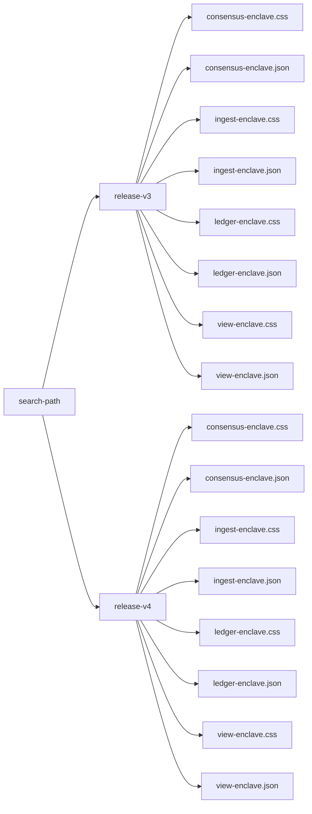

attest-verifier-config
======================

This crate specifies and implements a method for configuring an attestation
verifier based on sigstructs and other configuration data, which it finds using
a search path which is given to it. This search path is called the "attestation
trust root search path".

This is loosely based on how OS'es like linux often have a designated path where SSL trust roots are stored,
e.g. `/etc/ssl/certs`, `/usr/local/share/certs`. This is a bit different in that,
we're not assuming that there's an OS level path for mobilecoin attestation roots,
rather it's expected that when a mobilecoin client installs itself, somewhere in its installation
path it would do this, and the app would then pass this path to the code in this crate.
So, these trust roots would be private to an installation of the app.

Directory-layout
----------------

The files in the attestation trust root search path are expected to be laid out
according to a specific schema.

The schema we propose here is:

* The outermost directory contains subdirectories, named for releases. This is
  for organizational purposes and makes it a little easier update the trust set
  to exclude old releases.
* Each release directory contains `.css` files, one for each enclave that was released,
  and `.json` files, which contain information about the manner in which we trust
  that enclave, for example, a list of hardening advisories that apply to it.
* Each `.css` file must have a corresponding `.json` file, or it is considered
  invalid. (At the level of `mc-attest-verifier` code, the `.css` and the `.json`
  can together be used to create a `StatusVerifier`, and the `.json` format is
  meant to be extensible for future configuration options.)

For example, the file tree under the search-path may look like this:



Given an attestation trust root search path and an enclave name, the procedure
implemented here searches all subdirectories of the search path (to one level) for
valid `.css` and `.json` files matching that name, and builds appropriate `StatusVerifier`'s.

The `.json` files have the following schema:

```
{
    "identity_check": "MRENCLAVE",
    "mitigated_hardening_advisories": ["INTEL-SA-00334", "INTEL-SA-00615", "INTEL-SA-00657"],
}
```

* `identity_check`: This should be either `"MRENCLAVE"` or `"MRSIGNER"`, and indicates which identity we are checking during attestation verification.
* `mitigated_hardening_advisories`: This is the list of Intel SGX hardening advisories that are known to have been mitigated in this signed revision of the enclave.

Pros and cons
-------------

The advantages of this scheme are:

* We do not embed the `.css` file data into another data format, so we can continue to use Intel's
  tools and `mc-sgx-css-dump` easily.
* Use names of files in the filesystem to associate related files. This is fairly intuitive
  and avoids the need to create a manifest file of some kind that explicitly glues things together.
* We can fairly easily inspect a directory like this and see which releases it is supposed to have
  css files for, and we can use simple text editors to look at the individual json files.
* Pretty easy to point a binary at a directory like this, and doesn't cause an explosion of command
  line arguments to configure attestation.
* Pretty easy to update when a new release is made, we just delete the oldest release's subdirectory
  and add a new subdirectory for the new release.

The disadvantages of the scheme are:

* Many small files instead of one self-contained file.
* Probably want to think about permissions settings on this directory when installed.
  (Generally if an attacker can tamper with your wallet software installation,
  you are already in big trouble, even if everything is bundled into one binary.)
* Assumes the presence of a filesystem. This is likely valid on windows/mac/linux/ios/android.
  You might be able to fake this on wasm. For embedded devices, it probably isn't valid,
  and you'll have to figure something else out. However, I'm not sure that we expect embedded
  devices to be capable of directly talking to mobilecoin mainnet or fog right now.
