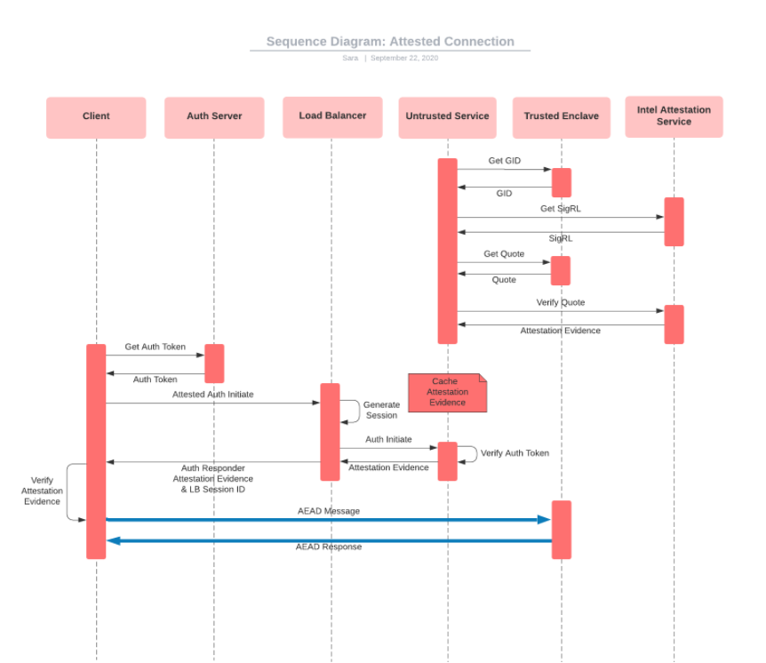

# Validating the Attestation

Upon making an attested connection, either via a client-node attested connection, or a node-node attested connection, the cached attestation evidence is validated.

The following example shows a sequence diagram for client-node attestation:

#### Live Intel Service Advisories

| Advisory         | Description                                                                                                            | Mitigation                                                                                         |
| ---------------- | ---------------------------------------------------------------------------------------------------------------------- | -------------------------------------------------------------------------------------------------- |
| `INTEL-SA-00334` | [Load Value Injection Advisory](https://www.intel.com/content/www/us/en/security-center/advisory/intel-sa-00334.html)  | CPUs which are not vulnerable to LVI will need to be deployed (these do not exist as of Sep 2020). |
