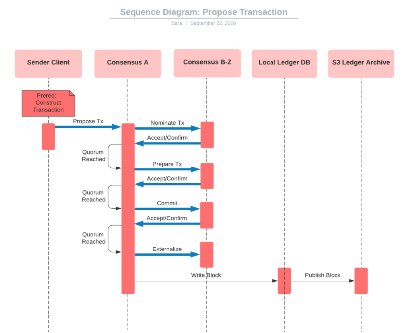

# Proposing Transactions

**Below is a sequence diagram detailing the process of a client sending a transaction to consensus, which is finally written to a block and published to the S3 ledger archive.**

